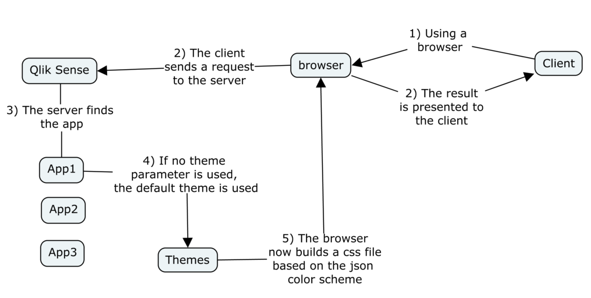
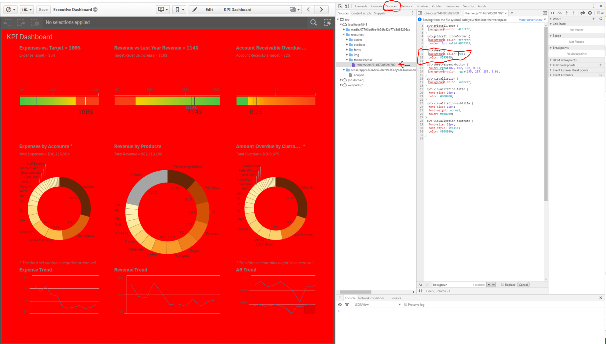

.. _color_scheme:

Color Scheme
============

.. danger:: Before modifying any files remember to take backup!

Qlik Sense does currently not officially support color shceme modification, but there is
an experimental feature that lets you test the capability.

Introduction
************

To understand how this work, think of Qlik Sense as a web server and the client accessing documents
through the browser:

Instead of using Qlik Sense to browse an application, you can use Google Chrome to open apps.
Make sure that Qlik Sense is running and browse this `URL <http://localhost:4848/hub/>`_:

.. code-block:: html

  localhost:4848/hub

This opens your hub utilizing the browser. If you change the url to /sense/app Qlik
Sense will look for a specific app, given as an parameter after the URL. For the default Executive Dashboard
substitute your username:

.. code-block:: html

  http://localhost:4848/sense/app/C%3A%5CUsers%5C<user>%5CDocuments%5CQlik%5CSense%5CApps%5CExecutive%20Dashboard/

This should open the app. Finally try to specify a specific sheet. Remember to specify username.

.. code-block:: html

  http://localhost:4848/sense/app/C%3A%5CUsers%5C<user>%5CDocuments%5CQlik%5CSense%5CApps%5CExecutive%20Dashboard/sheet/PfKsJK/state/analysis

With the sheet open in Google Chrome, activate the developer tools by pressing: Ctrl + Shift + I
Try to change the background-color of the sheet to red:

This should give you a good idea of how Qlik Sense works, and how/why we can change the
color scheme.

Change Color Scheme: Local
**************************

Change Color Scheme: Server
***************************
