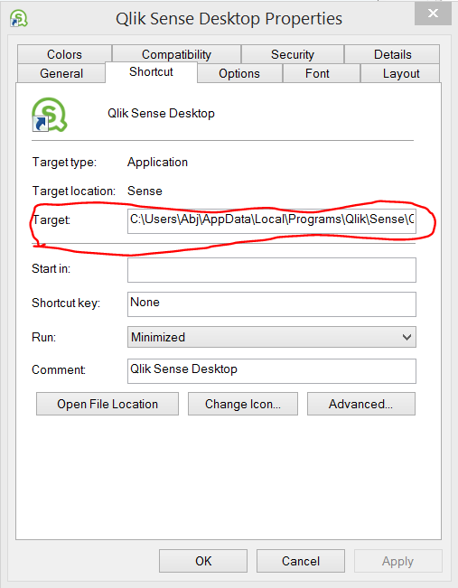

.. _color_scheme:

Color Scheme
============

.. danger:: You are about to use an experimental feature of Qlik Sense. Backup your files!

Introduction
------------

**Are looking for a way to change the look and fell of your Qlik Sense applications?**

Qlik Sense does currently not officially support color shceme modification, but there is
an experimental feature that lets you test the capability.
To understand how this work, think of Qlik Sense as a web server and the client accessing documents
through the browser:

.. figure:: images/color_scheme/iqsf_color_scheme_1.PNG
  :scale: 80%

Instead of using Qlik Sense to browse an application, you can use Google Chrome to open a Qlik Sense app.
Make sure that Qlik Sense is running and browse this `URL <http://localhost:4848/hub/>`_:

.. code-block:: html

  localhost:4848/hub

This opens your hub utilizing the browser. If you extend the URL with */sense/app* Qlik
Sense will look for a specific app. To open the the default Executive Dashboard copy this in your browser,
and make sure to substitute your username:

.. code-block:: html

  http://localhost:4848/sense/app/C%3A%5CUsers%5C<user>%5CDocuments%5CQlik%5CSense%5CApps%5CExecutive%20Dashboard/

This should open the app. Finally try to specify a specific sheet. Remember to substitute your username.

.. code-block:: html

  http://localhost:4848/sense/app/C%3A%5CUsers%5C<user>%5CDocuments%5CQlik%5CSense%5CApps%5CExecutive%20Dashboard/sheet/PfKsJK/state/analysis

With the sheet open in Google Chrome, activate the developer tools by pressing: Ctrl + Shift + I.
Try to change the background-color of the sheet to red:

.. figure:: images/color_scheme/iqsf_color_scheme_2.PNG
  :scale: 80%

This should give you a good idea of how Qlik Sense works, and how/why we can change the
color scheme. Now lets continue to look at how this can be implemented.

Change Color Scheme: temporary
------------------------------

Before changing the color scheme on our local machine, we first need a new color scheme.
You can download a color theme from the Clik Community called `highvis <https://community.qlik.com/docs/DOC-13517>`_.
After downloading and extracting the zip file, you copy the folder to the Qlik Sense themes folder:

The default location of the folder is

.. code-block:: html

  C:\Program Files\Qlik\Sense\Client\themes

If you do not know the location of Qlik Sense you can right click the program icon in the
windows menu bar and choose Properties. Under Shortcut\Target the path to Qlik Sense is listed.

After copying the file and if Qlik Sense is open, you can now open the default app
with a different theme by setting the parameter to highvis.

.. code-block:: html

  http://localhost:4848/sense/app/C%3A%5CUsers%5C<User>%5CDocuments%5CQlik%5CSense%5CApps%5CExecutive%20Dashboard/sheet/PfKsJK/state/analysis/theme/highvis

Change Color Scheme: permanent
------------------------------

To change the color scheme permanent, you have to change the default theme.

After you have done this, you have to change a javascript file called require.js
This is a JavaScript file and module loader. You can read more about it `here <http://requirejs.org/>`_.
The default path is:

.. code-block:: html

  C:\Program Files\Qlik\Sense\Client\assets\external\requirejs\require.js

Open a text editor and search for

.. code-block:: javascript

  define("text!

Now change the end of file accordingly:

.. code-block:: javascript

  function(a,b){function c(b)} // lots of code
  onBlockRender:function(){th  // lots of code
  //,define("text!themes/sen   // lots of code
  ;

The line we have commented out *//,define("text!themes...* declares the default theme inline. By removing the line,
Qlik Sense will now read the default theme, and you can change it accordingly.

Missing Features and todos
--------------------------

* Organizing custom color themes i.e. assigning custmo themes to specific applications.
  In a comment to this `Qlik Community post <https://community.qlik.com/docs/DOC-13517>`_ there is mentioned that *something is on the roadmap for 3.0+*.
* Designing color themes. A reasonable work around is to use the `atom <https://atom.io/>`_ text editor with two packages installed: `color-picker <https://atom.io/packages/color-picker>`_ and `pigments <https://github.com/abe33/atom-pigments>`_.
  Consider reading the atom flight `manual <http://flight-manual.atom.io/>`_.
  It gives you the possibility of viewing and setting colors in file:

  .. figure:: images/color_scheme/iqsf_color_scheme_atom.PNG
    :scale: 50%

* Understanding the role of the css file located with the theme. It is for example responsible for changes to sheet background color.
* The creation of theme github repository to share custom color themes
