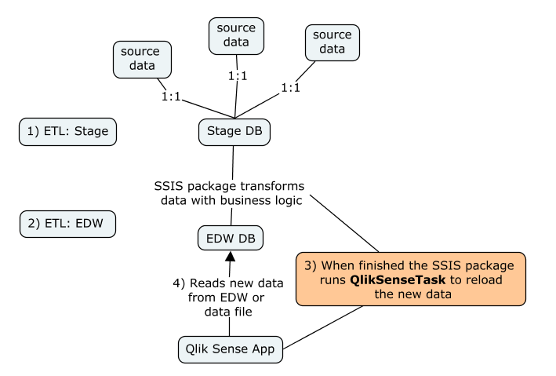

.. _extensions:

Extensions
==========

.. note:: Remember to test new extensions carefully on Qlik Sense Desktop or
  Qlik Sense server in a virtual environment.

**Qlik Sense Extensions: Custom features, services or visualizations**

One of the key features of Qlik Sense is the various API's and web technology.
This makes it easy for developers to extend the functionality of Qlik Sense.
This page is dedicated to recommend some of the best extensions and how we recommend
using them, as well as links to other sources for exploring, develop and share extensions.

Introduction to Extensions
--------------------------

Find your extension
******************
Qlik provides a webpage for exploring extensions called `Qlik Branch <http://branch.qlik.com/#!/project>`_.
If you are familiar with `Github <http://github.com>`_, most of the projects fortunately also hosted there.
Generally it is recommended to only use extensions hosted on Github, since this makes it possible to inspect the
code if needed, and engage in the open source development of key features. When exploring an extension on github
it is also possible to get an indication of how popular an extension is by looking at the following indicators:

.. figure:: images/extensions/Github_popularity.PNG.PNG
  :scale: 60%

The more commits, branches, releases and contributors, the more living the code is.

Recommended Extensions
----------------------

In the following we will recommended must have extensions for the entreprise Inspari Qlik Sense framework.

QlikSenseTask
*************

`Link to QlikSenseTask on branch <http://branch.qlik.com/#!/project/56f2e998f1c173fc24afe6ec>`_
`Link to QlikSenseTask on Github <https://github.com/eapowertools/QlikSenseTask>`_

This service makes it possible to start Qlik Sense tasks from the command line. This makes an excellent fit into an environment with SSIS,
or any other ETL tool since data can be reloaded when the task is finished is illustrated by the following figure:

**Installation**
Download as zip or clone from `Github <https://github.com/eapowertools/QlikSenseTask>`_, and extract the QlikSenseTask-x.x.zip file that fits for
your version of Qlik Sense.

.. note:: QlikSenseTask-2.X.zip have been tested successfully with Qlik Sense 3

After unzipping you have the 3 files you need; config, Newtonsoft.Json.dll and QlikSenseTask.exe.
Now open the config file and change the address to the Qlik Sense installation, and adjust the waiting time (default is 600 seconds).
Now you should be able to start a task. Create a task in QMC and change directory to the dir of QlikSenseTask.exe and run the task.

Example: qliksensetask -task:"Hello World"

Please refer to the documentation of QlikSenseTask for more information.

**Wishlist**

* Better documentation at the Github repository
* Ideas for default location to this script on the Sql Server.

Governed Metrics Service (GMS)
******************************

`Link to GMS on branch <http://branch.qlik.com/?&_ga=1.205648019.1497078496.1393695932#!/project/57655702febb2ca54e7149d2>`_
`Link to GMS on Github <https://github.com/eapowertools/GovernedMetricsService>`_

One of the most important extensions to Qlik Sense server is the Governed Metrics Service.
This service lets you manage the master data items.
