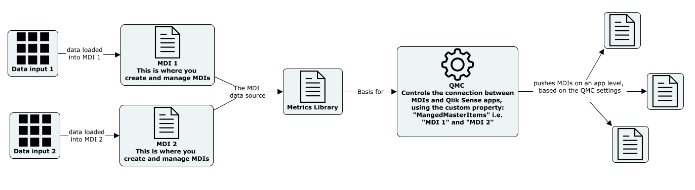

.. _mdi:

Governed Metrics Service
========================

Master data items is one of the building stones for a successfull self-service
implementation of Qlik Sense. With master items the task of creating and maintaining
expressions is centralized to a small group. To make the development of new master items
easy and maintainable we propose a combination of the following two services:

Overview
--------
To maximize the entreprise implementation of Master Data Items, a combination of the
two services above are suggested.

The Governed Metric Service
---------------------------

Inspari Master Data Items Service
---------------------------------
